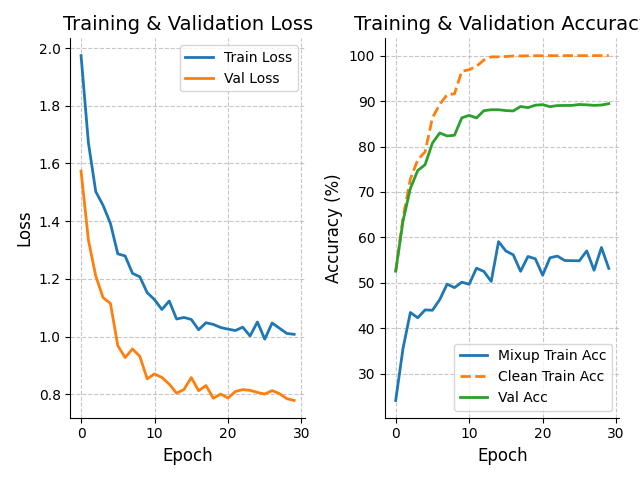

# CIFAR-10 Classification with ResNet18

The project shows a CNN application with ResNet architecture, which is used for image classification of CIFAR-10 dataset. CIFAR-10 is a basic dataset in computer vision containing 60,000 32x32 colored images representing 10 classes.
## Features

### Core Enhancements
- **Architecture**
  - Dropout-integrated BasicBlock (p=0.1)
  - Strong input dropout (p=0.3)
  - Kaiming Normal initialization

- **Training**
  - Mixup augmentation (α=0.4)
  - Label smoothing (ε=0.1)
  - Gradient clipping (max_norm=1.0)

- **Monitoring**
  - Live training/validation plots
  - Clean vs mixup accuracy tracking

##  Configuration

| Parameter          | Default | Recommended Range |
|--------------------|---------|-------------------|
| Batch Size         | 128     | [64, 256]         |
| Base LR            | 0.1     | [0.05, 0.2]       |
| Mixup α            | 0.4     | [0.2, 0.6]        |
| Label Smoothing    | 0.1     | [0.05, 0.2]       |

##  Performance
| Metric          | Result |
|-----------------|--------|
| Train Accuracy  | 100.0% |
| Val Accuracy    | 90.01% |
| Test Accuracy   | 88.80% |

##  References
- [ResNet Paper](https://arxiv.org/abs/1512.03385)
- [Mixup](https://arxiv.org/abs/1710.09412)